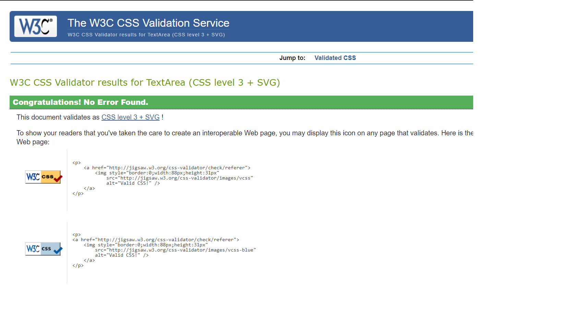
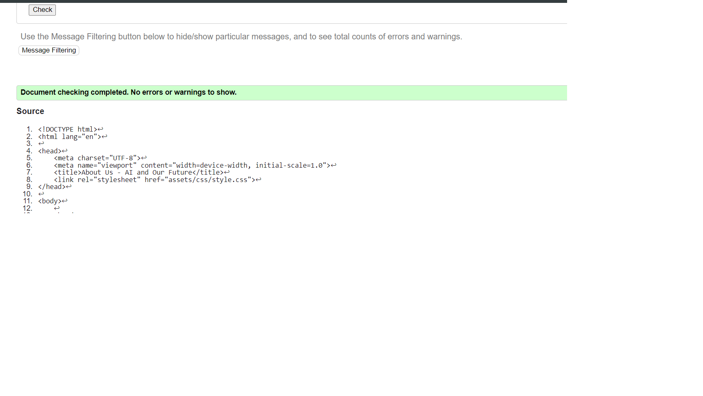

Home page and its contain the main part of the project ,and has 

About me page ,it is the inforatmion about why this page has been made . 

contact us page,it has the information  in case the reader wants to know more can follow by using the soical media .

This image give some hospitablity for the reader to follow us for more inforation  about Yemen .

After finshing the code , I checked it, and they showed no errors 

The lighthouse shows that there is some perfomance problem which, and has the 91%  accessibility 

Note***

I used in my code some code and restruchuring it from chatgpt 
and used some ready code, when I got stuck ,I made Chatgpt to restucher the code and explain some issues that I faced , hope this is okay **

