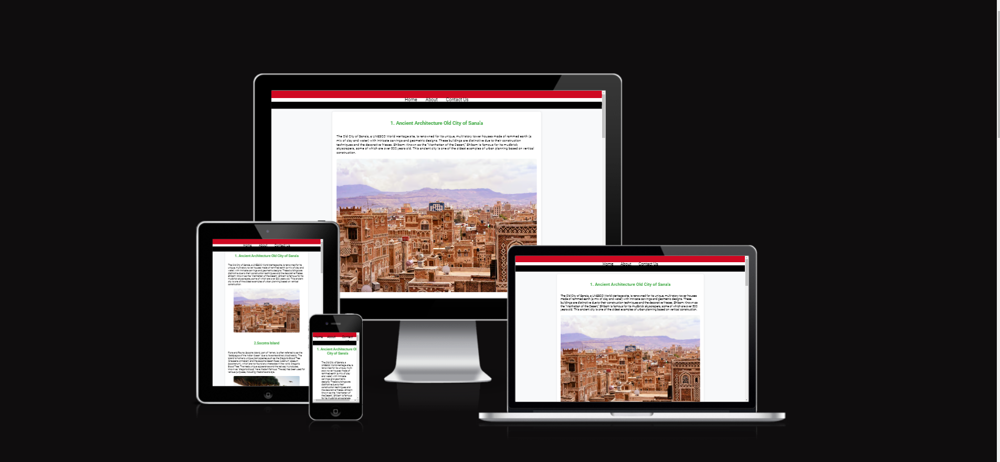
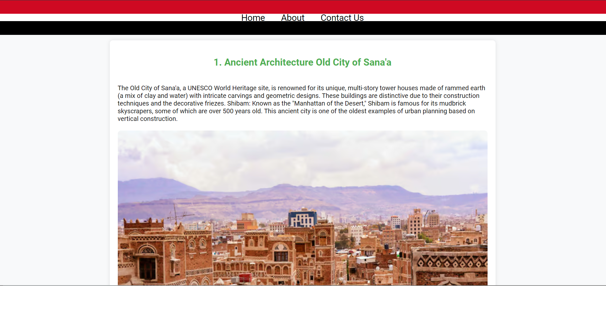
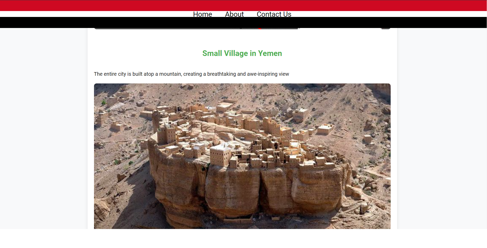
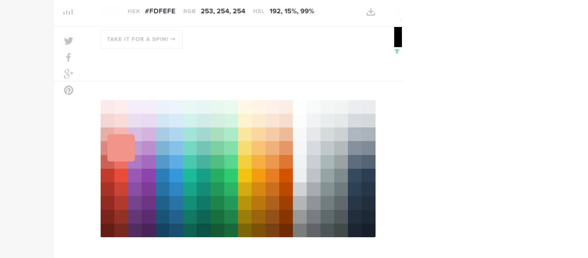
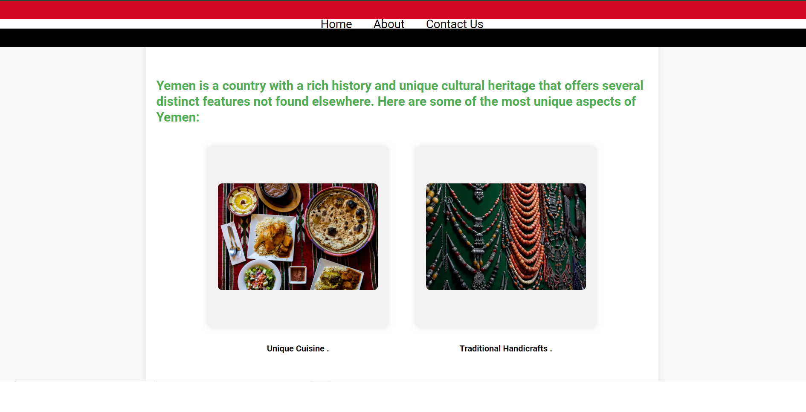

# [1PROJECT](https://afrah-tech.github.io/1project)

[](https://github.com/Afrah-tech/1project/commits/main)
[](https://github.com/Afrah-tech/1project/commits/main)
[](https://github.com/Afrah-tech/1project)


---------------------
### Sales Pitch:

Discover the enchanting allure of Yemen with **Yemen Odyssey**, your comprehensive guide to the rich history, vibrant culture, and breathtaking tourist destinations of this ancient land. Our website is meticulously crafted to provide an immersive experience, offering in-depth information on Yemen's storied past, from its ancient civilizations to its modern-day marvels. Whether you are a history enthusiast, a travel buff, or simply curious about this remarkable country, Yemen Odyssey aims to be your ultimate resource, blending historical insights with practical travel tips to create a one-stop destination for all things Yemen.

At **Yemen Odyssey**, we believe in the power of knowledge to inspire exploration and understanding. Our website is designed to inform users about Yemen's diverse cultural heritage, highlighting its unique artifacts, historic landmarks, and significant sites. Dive into the detailed accounts of ancient kingdoms, explore the significance of iconic landmarks like the Old City of Sana'a, and marvel at the intricate architecture of Shibam's towering mudbrick skyscrapers. Our carefully curated content not only educates but also ignites a sense of wonder and adventure, encouraging visitors to see Yemen in a new light.

Navigating **Yemen Odyssey** is a seamless experience, thanks to our user-friendly interface and thoughtfully organd sections. Easily access information through our interactive maps, visually stunning photo galleries, and detailed articles categorized by historical periods and tourist attractions. Whether you're planning a visit or simply exploring from afar, our website's intuitive design ensures you can find exactly what you're looking for with ease. Join us at Yemen Odyssey and embark on a journey through time and culture, uncovering the hidden gems and timeless treasures of this fascinating country.

________________________________





 

source: [amiresponsive](https://ui.dev/amiresponsive?url=https://afrah-tech.github.io/1project)

## UX

Website Design Overview
Project Goal: The primary aim of this website is to educate visitors about Yemen's rich history, offering easy navigation and direct communication options through a contact form.



Target Audience: The site targets students, historians, and anyone interested in learning about Yemen, ensuring the information is accessible and engaging for a diverse audience.

Design Process
- Planning and Structure
Pages Layout: Includes four main pages: Index.html (landing page), About (detailed historical insights), Contact Us (communication form), and a custom 404 error page.
- Design Implementation


![Homepage]READMEimages/homepage4.png)


Navigation Bar:
Fixed and Responsive: Ensures constant accessibility across all devices.


Thematic Style: Reflects Yemeni cultural elements for enhanced engagement.
Style and Images:
Aesthetic Choices: Employs a color palette inspired by Yemeni art and landscapes. Images are optimized for responsiveness and speed.


- Technical Aspects
Responsiveness and Accessibility: Built with HTML5 and CSS3, using Flexbox and CSS Grid for layout adjustments. The site is accessible and responsive across all modern devices.
- Testing and Optimization
Performance and Usability Testing: Includes tools like Google Lighthouse and user feedback to ensure optimal performance and usability.
- Deployment and Maintenance
Launch and Updates: After thorough testing, the site is launched with plans for regular content updates and technical enhancements.


### Colour Scheme

- `#000000` used for primary text and part of navbar .
- `#FFFFFF` used for primary navbar .
- `##cf0922 ` used for flag navbar.
- `#4CAF50;` used for Heading text.
- `#f1f1f1` used for the shadow of the boxes

- `rgba(0, 0, 0, 0.2)` Bar:hover 
- `rgba(0, 0, 0, 0.1)` used for Box-shadow and border 
- `#007BFF` used for button
- `#0056b3` used for utton:Hover


I used [htmlcolorcodes.com](https://htmlcolorcodes.com/) to generate my colour palette.




```

### Typography

- [Arial, sans-serif] was used for the primary headers and titles.

- [Roboto ] was used for all other secondary text.


## Features

-Easy Navigation: Simplifies user interaction by enabling quick access to desired information, enhancing user satisfaction and reducing bounce rates.


- Responsive Design: Ensures optimal viewing and usability across devices, improving accessibility and user engagement with seamless navigation and functionality.


- High Quality Visual Content: Enhances user experience by conveying information effectively, creating a visually appealing environment that encourages longer visits and higher interaction rates.



- [](https://tim.2bn.dev/markdown-builder) used to generate README and TESTING templates.
- [](https://git-scm.com) used for version control. (`git add`, `git commit`, `git push`)
- [](https://github.com) used for secure online code storage.

- [](https://gitpod.io) used as a cloud-based IDE for development.


- [](https://pages.github.com) used for hosting the deployed front-end site.

- [](https://chat.openai.com) used to help debug, troubleshoot, and explain things.

 [](https://chat.openai.com) used to help debug, troubleshoot, and explain things. 
 

## Testing
- using 
> [!NOTE]  
> For all testing, please refer to the [TESTING.md](TESTING.md) file.

## Deployment

The site was deployed to GitHub Pages. The steps to deploy are as follows:

- In the [GitHub repository](https://github.com/Afrah-tech/1project), navigate to the Settings tab 
- From the source section drop-down menu, select the **Main** Branch, then click "Save".
- The page will be automatically refreshed with a detailed ribbon display to indicate the successful deployment.

The live link can be found [here](https://afrah-tech.github.io/1project)

### Local Deployment

This project can be cloned or forked in order to make a local copy on your own system.

#### Cloning

You can clone the repository by following these steps:

1. Go to the [GitHub repository](https://github.com/Afrah-tech/1project) 
2. Locate the Code button above the list of files and click it 
3. Select if you prefer to clone using HTTPS, SSH, or GitHub CLI and click the copy button to copy the URL to your clipboard
4. Open Git Bash or Terminal
5. Change the current working directory to the one where you want the cloned directory
6. In your IDE Terminal, type the following command to clone my repository:
	- `git clone https://github.com/Afrah-tech/1project.git`
7. Press Enter to create your local clone.

Alternatively, if using Gitpod, you can click below to create your own workspace using this repository.

[](https://gitpod.io/#https://github.com/Afrah-tech/1project)

Please note that in order to directly open the project in Gitpod, you need to have the browser extension installed.
A tutorial on how to do that can be found [here](https://www.gitpod.io/docs/configure/user-settings/browser-extension).

#### Forking

By forking the GitHub Repository, we make a copy of the original repository on our GitHub account to view and/or make changes without affecting the original owner's repository.
You can fork this repository by using the following steps:

1. Log in to GitHub and locate the [GitHub Repository](https://github.com/Afrah-tech/1project)
2. At the top of the Repository (not top of page) just above the "Settings" Button on the menu, locate the "Fork" Button.
3. Once clicked, you should now have a copy of the original repository in your own GitHub account!

### Local VS Deployment


### Chatgpt  ,
###  Google search  
###  w3school , 


| Source | Location | Notes |
| --- | --- | --- |
| [Markdown Builder](https://tim.2bn.dev/markdown-builder) | README and TESTING | tool to help generate the Markdown files |
| [Chris Beams](https://chris.beams.io/posts/git-commit) | version control | "How to Write a Git Commit Message" |
| [W3Schools](https://www.w3schools.com/howto/howto_js_topnav_responsive.asp) | entire site | responsive HTML/CSS/JS navbar |
| [W3Schools](https://www.w3schools.com/howto/howto_css_modals.asp) | contact page | interactive pop-up (modal) |
| [W3Schools](https://www.w3schools.com/css/css3_variables.asp) | entire site | how to use CSS :root variables |
| [Flexbox Froggy](https://flexboxfroggy.com/) | entire site | modern responsive layouts |
| [Grid Garden](https://cssgridgarden.com) | entire site | modern responsive layouts |
| [StackOverflow](https://stackoverflow.com/a/2450976) | quiz page | Fisher-Yates/Knuth shuffle in JS |
| [YouTube](https://www.youtube.com/watch?v=YL1F4dCUlLc) | leaderboard | using `localStorage()` in JS for high scores |
| [YouTube](https://www.youtube.com/watch?v=u51Zjlnui4Y) | PP3 terminal | tutorial for adding color to the Python terminal |
| [strftime](https://strftime.org) | CRUD functionality | helpful tool to format date/time from string |
| [WhiteNoise](http://whitenoise.evans.io) | entire site | hosting static files on Heroku temporarily |


| Source | Location | Type | Notes |
| --- | --- | --- | --- |


### Acknowledgements


- I would like to thank my Code Institute mentor, [Tim Nelson](https://github.com/TravelTimN) for his support throughout the development of this project.
- I would like to thank the [Code Institute](https://codeinstitute.net) tutor team for their assistance with troubleshooting and debugging some project issues.
- I would like to thank the [Code Institute Slack community](https://code-institute-room.slack.com) for the moral support; it kept me going during periods of self doubt and imposter syndrome.
- I would like to thank my partner (John/Jane), for believing in me, and allowing me to make this transition into software development.
- I would like to thank my employer, for supporting me in my career development change towards becoming a software developer.
