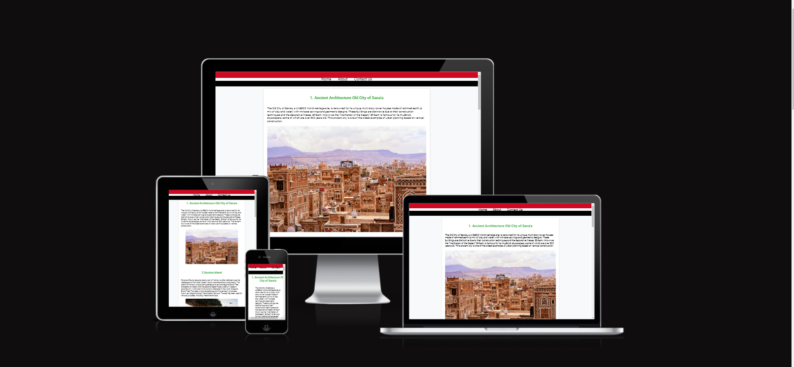
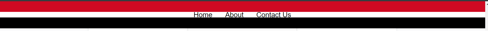
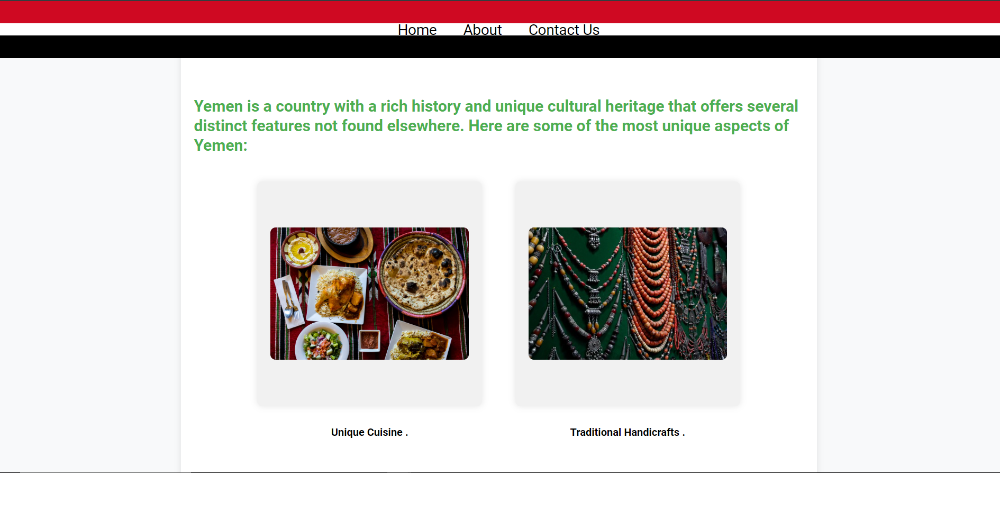

## Project Overview

**Yemen Odyssey** is a captivating website designed to explore the rich history and vibrant culture of Yemen. This site is a treasure trove of information for students, historians, and travelers, offering insights into Yemen’s ancient civilizations, cultural landmarks, and tourist attractions. **Yemen Odyssey** combines educational content with practical travel tips, making it the definitive guide for anyone looking to discover or learn about Yemen.

## Responsive Mockup

## Features

### Existing Features

- **Navigation Bar:** Featured on all pages, the navigation bar is fully responsive, providing easy access to the Home, About, Contact Us, and 404 error pages. This consistent navigation setup allows users to explore the site seamlessly across all devices.

  

- **High-Quality Visual Content:** The site uses visually appealing images and interactive elements to enhance user engagement and provide a rich browsing experience.

  

- **Responsive Design:** The website is optimized for all devices, ensuring that it delivers a smooth and accessible experience whether accessed from a desktop, tablet, or smartphone.

### Features Left to Implement

- **Interactive Timeline:** An interactive timeline detailing significant historical events could enhance educational value.
- **User Account System:** Allowing users to create accounts to save favorite articles and plan visits.

## Testing
Validator Testing
HTML
No errors were returned when passing through the official W3C validator
CSS
No errors were found when passing through the official 
          (Jigsaw) validator
Unfixed Bugs
You will need to mention unfixed bugs and why they were not fixed. This section should include shortcomings of the frameworks or technologies used. Although time can be a big variable to consider, paucity of time and difficulty understanding implementation is not a valid reason to leave bugs unfixed.

## Deployment

**Yemen Odyssey** is hosted on GitHub Pages, leveraging the platform's seamless deployment capabilities.

### Local vs. Deployed
Ensure all paths and dependencies are correct to avoid discrepancies between local and hosted versions.

### Content
- Historical information was carefully curated from reputable sources such as academic journals and historical databases.
- Instructional content for web development techniques was sourced from platforms like W3Schools and StackOverflow.

### Media
- Images: All images were sourced from cultural archives and royalty-free image providers, ensuring legal usage.

## Acknowledgements

- Thanks to the Code Institute for providing the educational framework.
- Special thanks to my mentor for guidance and support throughout the project lifecycle.

---

This template organizes the essential elements of your project into clear, concise sections, making it easy for stakeholders and peers to understand your project’s scope, features, and technical details.